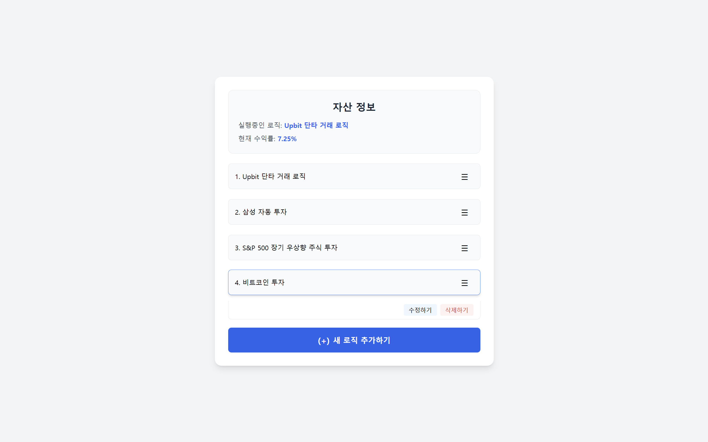

# 🚀 Trade Builder

<div align="center">


**코드 없이 설계하는 차세대 암호화폐 자동매매 플랫폼**

[](https://www.electronjs.org/)
[](https://reactjs.org/)
[](https://www.typescriptlang.org/)
[](https://retejs.org/)

</div>

---

## 💡 프로젝트 개요

**Trade Builder**는 프로그래밍 지식 없이도 **비주얼 노드 에디터**를 통해 고급 암호화폐 자동매매 전략을 설계하고 실행할 수 있는 **노 코드 데스크톱 애플리케이션**입니다.

### 🎯 핵심 가치
- **🎨 No-Code 인터페이스**: 드래그 앤 드롭으로 복잡한 매매 로직 구현
- **🤖 AI/ML 통합**: 강화학습 모델의 예측을 실시간 매매 신호로 활용
- **⚡ 멀티 전략 동시 실행**: 여러 매매 전략을 병렬로 독립 운영
- **🔒 안전한 API 관리**: 암호화된 로컬 저장소로 API 키 보안 유지
- **📊 실시간 모니터링**: 포트폴리오 현황과 로직 실행 상태를 한눈에 파악


---

## 🖥️ 주요 화면 및 기능

### 📈 AssetPage - 통합 대시보드

실시간 포트폴리오 관리와 멀티 로직 운영의 중심 허브



<details> 
  <summary><strong>📊 실시간 자산 모니터링 시스템</strong></summary>

<br>


#### 포트폴리오 분석 패널


- **총 자산 추적**: 현재 보유 암호화폐의 KRW 환산 총액 실시간 계산
- **ROI 지표**: 투자 수익률을 퍼센트와 절대값으로 동시 표시
- **일일 손익(P/L)**: 당일 거래 손익을 실시간으로 추적
- **Upbit API 직접 연동**: 지연 없는 실시간 시세 반영 (WebSocket 기반)

#### 보유 자산 상세 뷰

- **코인별 성과 분석**: 각 코인의 보유량, 평균 단가, 현재가, 수익률 표시
- **자동 업데이트**: 시세 변동 시 즉각 반영

</details>

<details>
  <summary><strong>⚙️ 인텔리전트 로직 관리 시스템</strong></summary>

<br>

#### 유연한 전략 운영
- **드래그 앤 드롭 재정렬**: 로직 우선순위를 직관적으로 조정
- **개별 제어**: 각 로직을 독립적으로 실행/중지/수정 가능
- **동적 간격 설정**: 로직별 실행 주기를 1초 단위로 세밀 조정
- **분리된 API 인증**: 로직마다 다른 Upbit API 키 할당 가능 (계정 분산 전략)

#### 로직 상태 시각화
- **실행 상태 인디케이터**: 실행 중/대기 중/오류 상태를 명확히 표시
- **실행 로그 추적**: 각 로직의 실행 이력과 결과 기록

</details>

<details>
  <summary><strong>🎨 테마 커스터마이징</strong></summary>

<br>

- **다크/라이트 모드 지원**: 장시간 모니터링에 최적화된 눈 보호 인터페이스
- **시스템 테마 연동**: OS 설정을 자동으로 감지하여 적용
- **영구 저장**: Electron Store를 통해 사용자 설정 유지

</details>

---

### 🎯 LogicEditorPage - 비주얼 전략 설계 스튜디오

Rete.js 기반 고급 노드 에디터로 복잡한 알고리즘 트레이딩 전략을 시각적으로 구현


<details>
  <summary><strong>🧩 프로페셔널 노드 에디터</strong></summary>

<br>

#### 강력한 그래픽 인터페이스
- **Rete.js 엔진**: 업계 표준 노드 편집 라이브러리로 유연한 편집 경험 제공
- **이중 그래프 아키텍처**: Buy Graph와 Sell Graph를 완전히 분리하여 매수/매도 전략을 독립 설계
- **직관적 연결 시스템**: 데이터 흐름을 시각적으로 확인하며 노드 간 연결
- **Zoom & Pan**: 복잡한 로직도 자유롭게 확대/축소하며 편집

#### 풍부한 노드 라이브러리
| 카테고리 | 노드 종류 |
|---------|---------|
| 📊 **기술적 지표** | RSI, SMA, EMA, 볼린저밴드, MACD 등 |
| 💰 **시장 데이터** | 현재가, 최고가, 최저가, 거래량, 호가 |
| 📈 **포지션 분석** | ROI, 보유량, 평균 단가, 평가 손익 |
| 🔢 **논리 연산** | AND, OR, NOT, XOR |
| ⚖️ **비교 연산** | >, <, >=, <=, ==, != |
| 🎲 **상수 입력** | 숫자, 비율, 임계값 설정 |
| 🤖 **AI 신호** | RL Signal, ML Prediction |

</details>

<details>
  <summary><strong>🔬 실시간 디버깅 및 백테스팅</strong></summary>

<br>

#### 인터랙티브 로그 시스템
- **노드별 상태 추적**: 각 노드의 입출력 값을 실시간으로 표시
- **조건 평가 가시화**: 매수/매도 조건이 충족되는 순간 즉시 알림
- **세부 로그 토글**: 성능 모니터링을 위한 상세 로그 on/off
- **타임스탬프 기록**: 모든 로직 실행 이벤트에 정확한 시간 기록

#### 백그라운드 자동 실행
- **주기적 평가**: 설정한 간격마다 자동으로 조건 확인 (1초~수시간 단위)
- **비동기 처리**: Web Worker 기반으로 UI 블로킹 없이 로직 실행
- **에러 핸들링**: 로직 오류 시 자동 중단 및 에러 메시지 표시

</details>

<details>
  <summary><strong>🧠 AI/ML 통합 - 강화학습 신호 활용</strong></summary>

<br>

#### Python RL 모델 연동
- **자동 프로세스 관리**: Electron에서 Python RL 스크립트를 자동 실행/종료
- **WebSocket 실시간 통신**: 밀리초 단위 저지연 신호 수신
- **RL Signal 노드**: 학습된 강화학습 모델의 예측을 매매 조건으로 직접 사용
- **모델 테스트 패널**: RL 모델의 출력을 실시간으로 모니터링하며 신뢰도 검증

#### 하이브리드 전략 구축
- 전통적 기술 지표(RSI, SMA)와 AI 예측을 조합하여 정교한 전략 설계
- 예: `(RSI < 30 AND RL_Signal == "BUY") OR (SMA_Cross == True)`

</details>

<details>
  <summary><strong>🔄 포터블 로직 관리</strong></summary>

<br>

#### JSON 기반 직렬화
- **완전한 상태 저장**: 노드 위치, 연결 관계, 파라미터 값을 JSON으로 직렬화
- **버전 관리 친화적**: Git 등 VCS로 로직의 변경 이력 추적 가능
- **Import/Export**: 로직을 파일로 내보내고, 다른 환경에서 재사용
- **로직 공유**: 전략을 커뮤니티와 공유하거나 백업 보관

#### 캔버스 최적화
- **전체 화면 확장**: Buy 또는 Sell 그래프를 전체 화면으로 확대하여 집중 편집
- **자동 레이아웃 조정**: 확장/축소 시 Rete Area가 자동으로 재계산되어 부드러운 전환
- **퍼포먼스 최적화**: 대규모 그래프에서도 60fps 유지

</details>

---

## ✨ 핵심 기술 하이라이트

### 🎨 비주얼 프로그래밍 인터페이스
```
코딩 지식 불필요 → 드래그 앤 드롭으로 전략 구축
```
- **Zero-Code Paradigm**: 프로그래밍 언어 없이 복잡한 트레이딩 알고리즘 구현
- **노드 라이브러리**: 10+ 카테고리, 30+ 종류의 프리셋 노드 제공
- **동적 연결 검증**: 타입 체크로 잘못된 노드 연결 방지
- **확장 가능 아키텍처**: 새로운 지표나 조건을 쉽게 노드로 추가 가능

### ⚙️ 엔터프라이즈급 실행 엔진

#### AST 기반 컴파일러
```typescript
노드 그래프 → AST 변환 → 토폴로지 정렬 → 최적화 실행
```
- **추상 구문 트리(AST)**: 노드 그래프를 프로그래밍 언어의 AST로 변환
- **의존성 해결**: 토폴로지 정렬로 노드 실행 순서 자동 최적화
- **순환 참조 감지**: 무한 루프 방지를 위한 그래프 검증
- **지연 평가**: 필요한 노드만 선택적으로 평가하여 성능 향상

#### 병렬 멀티 로직 실행
- **Web Worker 기반**: 각 로직이 독립 워커에서 실행되어 메인 스레드 블로킹 제로
- **동시 실행**: 수십 개의 전략을 동시에 모니터링 및 실행
- **로직별 스케줄링**: 각 전략마다 다른 실행 주기 설정 (1초 ~ 24시간)

### 🔗 Upbit API 완전 통합

#### 실시간 시장 데이터
| 데이터 타입 | 설명 | 업데이트 주기 |
|-----------|------|------------|
| 현재가 | 최신 체결 가격 | 실시간 (WebSocket) |
| 캔들 데이터 | OHLCV 차트 데이터 | 1분/5분/15분/1시간/1일 |
| 호가 | 매수/매도 호가창 | 실시간 |
| 최고가/최저가 | 기간별 극값 | 캐시 + 주기적 갱신 |

#### 자동 주문 시스템
- **시장가 주문**: 즉시 체결 (Market Buy/Sell)
- **지정가 주문**: 원하는 가격에 주문 대기 (Limit Order)
- **전량 매도**: 보유 코인 한 번에 청산
- **분할 매수**: KRW 금액 기준 자동 수량 계산
- **JWT 인증 자동화**: API 서명 생성 및 갱신 자동 처리

#### 계좌 및 잔고 관리
- 실시간 보유 코인 목록 조회
- 평균 매수가 자동 계산
- KRW 잔고 확인
- 로직별 API 키 분리 관리 (멀티 계정 지원)

### 🤖 AI/ML 파이프라인 통합

#### 강화학습(RL) 모델 연동
```
Python RL 모델 → WebSocket → Electron App → RL Signal 노드
```
- **자동 프로세스 런처**: Electron에서 Python 스크립트 생애주기 관리
- **실시간 양방향 통신**: WebSocket으로 밀리초 단위 신호 전송
- **노드 인터페이스**: RL 모델의 출력을 일반 노드처럼 사용
- **확장 가능**: 다른 ML 프레임워크(TensorFlow, PyTorch)도 동일 방식으로 통합 가능

#### 하이브리드 전략
- 전통적 기술 분석(TA)과 머신러닝 예측을 논리적으로 조합
- 예: `RSI < 30 AND RL_Confidence > 0.8`

### 🔐 보안 및 데이터 관리

#### 암호화된 로컬 저장소
- **Electron Store**: AES-256 암호화로 API 키 및 설정 보호
- **로직 파일 관리**: 각 전략을 JSON으로 버전 관리 가능
- **민감 정보 격리**: API 키는 메모리에만 로드, 로그에 노출 차단

#### 자동 백업 시스템
- 로직 변경 시 즉시 디스크에 동기화
- 애플리케이션 크래시 시에도 데이터 손실 방지

---

## 🚀 빠른 시작 가이드

### 📋 시스템 요구사항

| 구성 요소 | 최소 버전 | 권장 버전 |
|----------|----------|----------|
| **Node.js** | 18.0+ | 20.0+ |
| **npm** | 9.0+ | 10.0+ |
| **Python** | 3.8+ (선택) | 3.10+ |
| **OS** | Windows 10, macOS 11, Ubuntu 20.04 | 최신 버전 |
| **RAM** | 4GB | 8GB+ |

### ⚙️ 설치 및 실행

#### 1️⃣ 프로젝트 클론 및 의존성 설치
```bash
# 저장소 클론
git clone https://github.com/your-repo/trade-builder.git
cd trade-builder

# 패키지 설치
npm install
```

#### 2️⃣ 개발 모드 실행
```bash
# Vite + Electron 동시 실행 (Hot Reload 지원)
npm run electron:dev
```
- Vite 개발 서버: `http://localhost:5173`
- Electron 앱 자동 실행

#### 3️⃣ 프로덕션 빌드 (선택)
```bash
# TypeScript 컴파일 + Vite 빌드
npm run build

# 실행 파일 패키징
npm run package  # Windows: .exe, macOS: .dmg, Linux: .AppImage
```

### 🔑 Upbit API 키 설정

#### API 키 발급
1. [Upbit Open API](https://upbit.com/service_center/open_api_guide) 페이지 접속
2. 로그인 후 API 키 생성
3. **필수 권한 체크**:
   - ✅ 자산 조회 (Assets)
   - ✅ 주문 조회 (Orders - Read)
   - ✅ 주문하기 (Orders - Create)
   - ❌ 출금 권한은 체크 해제 (보안)

#### 앱에서 설정
1. Trade Builder 실행
2. AssetPage 상단의 **"API 키 설정"** 버튼 클릭
3. Access Key와 Secret Key 입력
4. 로직별로 다른 API 키 사용 시 LogicEditorPage에서 개별 설정

---

## 🧩 노드 레퍼런스

### 📊 데이터 소스 노드

| 노드 이름 | 기능 | 입력 | 출력 | 사용 예시 |
|---------|------|------|------|---------|
| **Constant** | 고정 수치 입력 | - | `Number` | 임계값 설정 (예: `30`, `0.5`) |
| **Current Price** | 실시간 현재가 | - | `Number` | 특정 코인의 최신 체결가 |
| **Highest Price** | 기간별 최고가 | `기간(분)` | `Number` | 24시간 최고가 조회 |
| **RSI** | 상대강도지수 | `기간(일)` | `Number` | 과매수/과매도 판단 (기본: 14일) |
| **SMA** | 단순이동평균 | `기간(일)` | `Number` | 추세 확인 (예: 20일선, 60일선) |
| **ROI** | 투자 수익률 | - | `Number` | 현재 포지션 수익률 (%) |
| **RL Signal** | AI 모델 예측 | - | `Number/Boolean` | 강화학습 모델의 매매 신호 |

### 🔢 연산 노드

| 노드 이름 | 기능 | 입력 | 출력 | 사용 예시 |
|---------|------|------|------|---------|
| **Compare** | 비교 연산 | `A`, `B`, `연산자` | `Boolean` | `RSI > 70`, `Price <= SMA` |
| **Logic Op** | 논리 연산 | `조건1`, `조건2`, `연산자` | `Boolean` | `(RSI < 30) AND (Volume > 1000)` |
| **Math Op** | 수학 연산 | `A`, `B`, `연산자` | `Number` | `Price * 1.05` (5% 상승가) |

#### 지원 연산자
- **Compare**: `>`, `<`, `>=`, `<=`, `==`, `!=`
- **Logic Op**: `AND`, `OR`, `NOT`, `XOR`
- **Math Op**: `+`, `-`, `*`, `/`, `%`, `**` (거듭제곱)

### 🎬 액션 노드

| 노드 이름 | 기능 | 입력 | 사용 가능 그래프 |
|---------|------|------|----------------|
| **BUY** | 매수 실행 | `Boolean 조건` | Buy Graph only |
| **SELL** | 매도 실행 | `Boolean 조건` | Sell Graph only |

> **⚠️ 주의**: BUY 노드는 Sell Graph에서, SELL 노드는 Buy Graph에서 사용 불가

---

## 🏗️ 기술 스택 아키텍처

### Frontend Layer
```
React 19 (UI Framework)
├── Vite 5.0 (Build Tool & Dev Server)
├── TypeScript 5.8 (Type Safety)
├── Rete.js 2.0 (Node Editor Engine)
├── Styled Components 5.3 (CSS-in-JS)
└── React DnD (Drag & Drop)
```

| 기술 | 버전 | 역할 |
|-----|------|------|
| **React** | 19.1.1 | 컴포넌트 기반 UI 렌더링 |
| **Vite** | 최신 | 초고속 HMR, ESM 기반 빌드 |
| **Rete.js** | 2.0.6 | 노드 그래프 편집 엔진 ([공식문서](https://retejs.org/)) |
| **TypeScript** | 5.8.3 | 정적 타입 체크 및 IntelliSense |
| **Styled Components** | 5.3.11 | 동적 스타일링 및 테마 관리 |

### Desktop Platform
```
Electron 38.2.2 (Chromium + Node.js)
├── Main Process (Node.js)
│   ├── Electron Store (Encrypted Storage)
│   ├── IPC Communication
│   └── Python Subprocess Manager
└── Renderer Process (Chromium)
    └── React Application
```

| 기술 | 역할 |
|-----|------|
| **Electron** | 크로스 플랫폼 데스크톱 런타임 |
| **Electron Store** | AES-256 암호화 로컬 스토리지 |
| **IPC (Inter-Process Communication)** | Main ↔ Renderer 통신 |

### Backend Integration
```
Upbit REST API (HTTP)
├── JWT Authentication
├── Rate Limiting Handler
└── Error Retry Logic

WebSocket Server
└── Python RL Model ↔ Electron App
```

| 서비스 | 프로토콜 | 용도 |
|--------|---------|------|
| **Upbit API** | HTTPS + JWT | 시세 조회, 주문 실행, 계좌 관리 |
| **WebSocket** | WS | RL 모델 실시간 신호 수신 |
| **Python Subprocess** | stdin/stdout | RL 모델 프로세스 관리 |

### Data Processing
```
AST Interpreter Engine
├── Graph → AST Conversion
├── Topological Sorting
├── Lazy Evaluation
└── Web Worker Execution
```

### AI/ML Integration
```
Python 3.8+
├── Reinforcement Learning Model
├── WebSocket Client
└── NumPy, PyTorch, TensorFlow (선택)
```

---

## 📚 실전 전략 예시

### 🎓 초급: RSI 기반 과매수/과매도 전략
**목표**: RSI 30 이하면 매수, 70 이상이면 매도

<details>
<summary><strong>Buy Graph 구성 (클릭하여 펼치기)</strong></summary>

```
[RSI (period=14)] ──┐
                     ├─→ [Compare (<=)] ──→ [BUY]
[Constant (30)]   ──┘
```

**단계별 구성**:
1. `RSI` 노드 추가 → 기간: `14` 설정
2. `Constant` 노드 추가 → 값: `30` 입력
3. `Compare` 노드 추가 → 연산자: `<=` 선택
4. RSI 출력 → Compare 왼쪽 입력
5. Constant 출력 → Compare 오른쪽 입력
6. `BUY` 노드 추가
7. Compare 출력 → BUY 입력

</details>

<details>
<summary><strong>Sell Graph 구성</strong></summary>

```
[RSI (period=14)] ──┐
                     ├─→ [Compare (>=)] ──→ [SELL]
[Constant (70)]   ──┘
```

**논리**: RSI가 70 이상이면 과매수 구간으로 판단하여 매도

</details>

**예상 효과**: 
- ✅ 과매도 구간에서 저가 매수
- ✅ 과매수 구간에서 고가 매도
- ⚠️ 횡보장에서 빈번한 매매 발생 가능

---

### 🎖️ 중급: SMA 골든크로스 + RSI 복합 전략
**목표**: 단기 이동평균이 장기 이동평균을 상향 돌파하고 RSI < 30일 때 매수

<details>
<summary><strong>Buy Graph 구성 (복합 조건)</strong></summary>

```
[SMA (period=20)] ──┐
                     ├─→ [Compare (>)] ──┐
[SMA (period=50)] ──┘                    │
                                          ├─→ [Logic Op (AND)] ──→ [BUY]
[RSI (period=14)] ──┐                    │
                     ├─→ [Compare (<)]  ──┘
[Constant (30)]   ──┘
```

**단계별 구성**:
1. **골든크로스 감지**:
   - `SMA (20일)`, `SMA (50일)` 노드 추가
   - `Compare (>)` 노드로 단기선 > 장기선 확인
2. **RSI 조건 추가**:
   - `RSI (14일)` 노드 추가
   - `Constant (30)` 노드 추가
   - `Compare (<)` 노드로 RSI < 30 확인
3. **조건 결합**:
   - `Logic Op (AND)` 노드로 두 조건 모두 만족 시만 매수

</details>

**예상 효과**:
- ✅ 상승 추세 전환 시점에 진입
- ✅ RSI 조건으로 과도한 고점 매수 방지
- ⚠️ 시그널 빈도가 낮아 기회 제한적

---

### 🏆 고급: AI + 기술적 지표 하이브리드 전략
**목표**: 강화학습 모델과 기술적 지표를 결합한 고신뢰도 매매

<details>
<summary><strong>Buy Graph 구성 (AI 통합)</strong></summary>

```
[RL Signal] ────────→ [Compare (== "BUY")] ──┐
                                              │
[RSI (14)] ──┐                               ├─→ [Logic Op (AND)] ──┐
              ├─→ [Compare (<)] ──────────────┘                       │
[Constant 35]─┘                                                       │
                                                                      ├─→ [BUY]
[Current Price] ──┐                                                  │
                   ├─→ [Compare (>)] ────────────────────────────────┘
[SMA (20)]      ──┘
```

**전략 로직**:
1. **AI 신호**: RL 모델이 "BUY" 예측
2. **RSI 필터**: RSI < 35 (강한 매수 신호)
3. **추세 확인**: 현재가 > 20일 이동평균 (상승 추세)
4. **3가지 조건 모두 만족 시 매수**

</details>

<details>
<summary><strong>Python RL 모델 연동 설정</strong></summary>

**1. RL 모델 준비**:
```python
# rl_model.py
import websocket
import json

ws = websocket.WebSocket()
ws.connect("ws://localhost:8080")

while True:
    # 모델 예측
    prediction = model.predict(market_data)
    
    # Electron App으로 신호 전송
    ws.send(json.dumps({
        "action": "BUY" if prediction > 0.7 else "SELL",
        "confidence": prediction
    }))
```

**2. Electron에서 자동 실행**:
- `electron/rl_launcher.js`에서 Python 스크립트 자동 실행
- WebSocket 서버로 신호 수신
- `RL Signal` 노드에서 실시간 값 사용

</details>

**예상 효과**:
- ✅ AI의 패턴 인식 + 검증된 기술적 지표 조합
- ✅ 높은 승률 및 안정적인 수익
- ⚠️ RL 모델 학습 및 유지보수 필요

---

### 💎 프로페셔널: 리스크 관리 포함 전략
**목표**: 손절/익절 조건을 자동화한 포지션 관리

<details>
<summary><strong>Sell Graph 구성 (손절/익절)</strong></summary>

```
[ROI] ──┐
         ├─→ [Compare (<)] ──→ [Constant (-5%)] ──┐
         │                                         │
         ├─→ [Compare (>)] ──→ [Constant (15%)] ──┤
         │                                         │
         └─────────────────────────────────────────┴─→ [Logic Op (OR)] ──→ [SELL]
```

**논리**:
- 손절: ROI < -5% (5% 손실 시 손절)
- 익절: ROI > 15% (15% 수익 시 익절)
- 둘 중 하나라도 만족하면 매도

</details>

**예상 효과**:
- ✅ 손실 제한으로 리스크 관리
- ✅ 이익 확정으로 수익 보호
- ⚠️ 변동성 큰 장에서 조기 청산 가능

---

## 🏛️ 소프트웨어 아키텍처 설계

### 1️⃣ AST 기반 인터프리터 엔진

#### 실행 파이프라인
```
노드 그래프 → AST 변환 → 의존성 분석 → 토폴로지 정렬 → 평가 실행
```

**핵심 알고리즘**:
- **Graph → AST**: Rete.js 그래프를 프로그래밍 언어의 추상 구문 트리로 변환
- **Topological Sort**: DAG(Directed Acyclic Graph) 기반으로 노드 실행 순서 결정
- **Lazy Evaluation**: 필요한 경로의 노드만 선택적으로 평가 (성능 최적화)
- **Cycle Detection**: 순환 참조 감지 시 에러 메시지와 함께 실행 중단

**장점**:
- ✅ 복잡한 의존성 자동 해결
- ✅ 컴파일러 수준의 최적화 가능
- ✅ 디버깅 및 로깅 용이

---

### 2️⃣ 멀티스레드 병렬 실행 모델

#### Web Worker 아키텍처
```
Main Thread (UI)
    │
    ├─→ Worker 1: Logic A (30초마다)
    ├─→ Worker 2: Logic B (60초마다)
    ├─→ Worker 3: Logic C (5분마다)
    └─→ Worker 4: RL Model Communication
```

**설계 특징**:
- 각 로직이 독립 Worker에서 실행 → **메인 스레드 블로킹 제로**
- Worker 간 메시지 전달로 결과 수신
- 에러 발생 시 해당 Worker만 종료, 다른 로직에 영향 없음

**성능 벤치마크**:
- 10개 로직 동시 실행 시 UI 프레임 드롭 없음 (60fps 유지)
- CPU 부하 분산으로 멀티코어 활용 극대화

---

### 3️⃣ 계층화된 API 관리 시스템

#### 3-Tier Architecture
```
┌─────────────────────────────────┐
│   Presentation Layer (UI)       │  ← React Components
├─────────────────────────────────┤
│   Business Logic Layer          │  ← Interpreter, Logic Runner
│   (AST, Node Evaluation)        │
├─────────────────────────────────┤
│   Data Access Layer             │  ← API Manager
│   (Upbit API, WebSocket)        │
└─────────────────────────────────┘
```

**API Manager 기능**:
- **JWT 인증 자동화**: Access Token 생성 및 갱신
- **Rate Limiting 핸들링**: Upbit API 제한(초당 10회) 준수
- **Retry Logic**: 네트워크 오류 시 지수 백오프로 재시도
- **캐싱**: 중복 요청 방지 (현재가, 캔들 데이터)

---

### 4️⃣ 확장 가능한 플러그인 시스템

#### 노드 추가 예시
```typescript
// 새로운 노드 추가 (예: 볼린저 밴드)
export class BollingerBandAST extends AST {
    async evaluate(): Promise<{ upper: number, middle: number, lower: number }> {
        const sma = await this.calculateSMA(20);
        const stdDev = await this.calculateStdDev(20);
        return {
            upper: sma + 2 * stdDev,
            middle: sma,
            lower: sma - 2 * stdDev
        };
    }
}
```

**확장성**:
- 각 노드는 독립적인 AST 클래스로 구현
- 타입스크립트로 입출력 타입 강제
- 새 노드 추가 시 기존 코드 수정 불필요 (OCP 원칙)

---

## 🎯 프로젝트 로드맵

### ✅ 완료된 기능 (v1.0)
- [x] Rete.js 기반 비주얼 노드 에디터
- [x] Upbit API 완전 통합 (REST + WebSocket)
- [x] AST 인터프리터 엔진
- [x] 멀티 로직 동시 실행
- [x] 강화학습 모델 통합 (RL Signal)
- [x] 실시간 포트폴리오 대시보드
- [x] 암호화된 로컬 스토리지
- [x] 다크/라이트 테마

### 🚧 개발 중 (v1.1)
- [ ] 백테스팅 시스템 (과거 데이터로 전략 검증)
- [ ] 알림 시스템 (Telegram, Discord, Email)
- [ ] 다중 거래소 지원 (Binance, Bithumb)
- [ ] 전략 마켓플레이스 (커뮤니티 전략 공유)

### 🔮 계획 중 (v2.0)
- [ ] 클라우드 백업 및 동기화
- [ ] 모바일 앱 (React Native)
- [ ] 소셜 트레이딩 (타인의 전략 복사)
- [ ] 고급 차트 분석 도구
- [ ] 포트폴리오 최적화 AI

---

## 🤝 기여 가이드

### 기여 방법
1. Fork this repository
2. Create your feature branch (`git checkout -b feature/AmazingFeature`)
3. Commit your changes (`git commit -m 'Add some AmazingFeature'`)
4. Push to the branch (`git push origin feature/AmazingFeature`)
5. Open a Pull Request

### 개발 환경 설정
```bash
# 개발 브랜치로 전환
git checkout develop

# 의존성 설치
npm install

# 개발 서버 실행
npm run electron:dev
```

### 코드 스타일
- **ESLint**: 코드 품질 검사 (`npm run lint`)
- **TypeScript**: 엄격 모드 활성화
- **Prettier**: 자동 포맷팅 (저장 시 적용)

---

## 📞 지원 및 커뮤니티

### 문의 채널
- **Issue Tracker**: [GitHub Issues](https://github.com/your-repo/trade-builder/issues)
- **Discussion**: [GitHub Discussions](https://github.com/your-repo/trade-builder/discussions)
- **Email**: support@tradebuilder.dev

### 문서
- 📖 [사용자 가이드](docs/user-guide.md)
- 🛠️ [개발자 문서](docs/developer.md)
- 🎓 [튜토리얼](docs/tutorials/)

---

## 📊 프로젝트 통계


---

## 📄 라이선스

이 프로젝트는 **MIT License** 하에 배포됩니다. 자유롭게 사용, 수정, 배포할 수 있습니다.

```
MIT License

Copyright (c) 2025 Trade Builder Team

Permission is hereby granted, free of charge, to any person obtaining a copy
of this software and associated documentation files (the "Software"), to deal
in the Software without restriction...
```

전체 라이선스는 [LICENSE](LICENSE) 파일을 참조하세요.

---

## ⚠️ 면책 조항 및 주의사항

### 투자 리스크 경고
> **암호화폐 투자는 원금 손실의 위험이 있으며, 투자 결과에 대한 책임은 투자자 본인에게 있습니다.**

- 📉 **고위험 자산**: 암호화폐는 변동성이 매우 높은 고위험 자산입니다
- 🧪 **충분한 테스트**: 실제 자금 투입 전 시뮬레이션 모드로 전략을 검증하세요
- 🔐 **API 키 보안**: API 키를 타인과 공유하거나 공개 저장소에 업로드하지 마세요
- 💰 **소액 투자**: 처음에는 소액으로 시작하여 시스템에 익숙해지세요
- 📚 **지속적인 학습**: 암호화폐 시장과 기술적 분석에 대한 이해를 높이세요

### 소프트웨어 면책
- 본 소프트웨어는 "있는 그대로(AS-IS)" 제공됩니다
- 개발자는 소프트웨어 사용으로 인한 직간접적 손실에 대해 법적 책임을 지지 않습니다
- 버그나 오작동 가능성이 있으므로 항상 모니터링하며 사용하세요

### 권장 사항
- ✅ 손절/익절 로직을 반드시 포함하세요
- ✅ 여유 자금으로만 투자하세요
- ✅ 정기적으로 로직 성과를 검토하고 개선하세요
- ✅ API 권한은 필요한 것만 부여하세요 (출금 권한 제외)

---

<div align="center">

**Made with ❤️ by Trade Builder Team**

⭐ 이 프로젝트가 도움이 되었다면 Star를 눌러주세요!

[🚀 시작하기](#-빠른-시작-가이드) • [📖 문서](docs/) • [🐛 버그 리포트](https://github.com/your-repo/trade-builder/issues)

</div>
